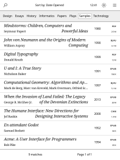
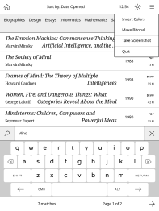
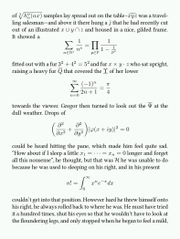

*Plato* is a document reader for *Kobo*'s e-readers.

It was tested on the following devices:

- *Aura ONE* (FW 4.7.10413).
- *Glo HD* (FW 4.7.10413 and 3.19.5761).
- *Aura H₂O Edition 2*.
- *Aura Edition 2*.
- *Glo*.
- *Touch C*.

## Supported formats

- PDF, ePUB and CBZ via *mupdf*.
- DJVU via *djvulibre*.

## Features

- Hierarchical categories.
- The metadata for each document is read from a single JSON file.
- Crop margins of non-reflowable documents.

  

