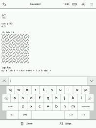

*Plato* is a document reader for *Kobo*'s e-readers.

Documentation: [GUIDE](doc/GUIDE.md), [MANUAL](doc/MANUAL.md) and [BUILD](doc/BUILD.md).

## Supported firmwares

Any 4.*X*.*Y* firmware, with *X* ≥ 6, will do.

## Supported devices

- *Clara BW*
- *Elipsa 2E*.
- *Clara 2E*.
- *Libra 2*.
- *Sage*.
- *Elipsa*.
- *Nia*.
- *Libra H₂O*.
- *Forma*.
- *Clara HD*.
- *Aura H₂O Edition 2*.
- *Aura Edition 2*.
- *Aura ONE*.
- *Glo HD*.
- *Aura H₂O*.
- *Aura*.
- *Glo*.
- *Touch C*.
- *Touch B*.

## Supported formats

- PDF, CBZ, FB2, MOBI, XPS and TXT via [MuPDF](https://mupdf.com/index.html).
- ePUB through a built-in renderer.
- DJVU via [DjVuLibre](http://djvu.sourceforge.net/index.html).

## Features

- Crop the margins.
- Continuous fit-to-width zoom mode with line preserving cuts.
- Rotate the screen (portrait ↔ landscape).
- Adjust the contrast.
- Define words using *dictd* dictionaries.
- Annotations, highlights and bookmarks.
- Retrieve articles from online sources through [hooks](doc/HOOKS.md) (an example *wallabag* [article fetcher](doc/ARTICLE_FETCHER.md) is provided).

   

## Donations

