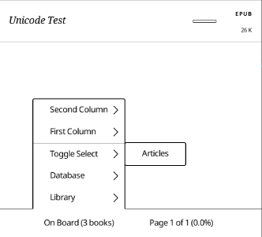
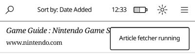

Plato provides a built-in article fetcher that can retrieve articles from wallabag installations.

## Setup

### Article Fetcher
1. Update the `Settings-example.toml` config in `bin/article_fetcher/` with your wallabag information
   
    ```toml
    # E.g.: https://framabag.org or https://app.wallabag.it.
    base-url = "https://framabag.org"

    # Login information.
    username = "?"
    password = "?"

    # Can be generated from the *API clients management* section of the Web UI.
    client-id = "?"
    client-secret = "?"
    ```
2. Rename the `Settings-example.toml` config to `Settings.toml`, leaving it in the same directory.

### Plato

1. Update `Settings.toml` for plato, adding the following hook  **directly after a `[[libraries]]` section**, if it does not exist.

    ```toml
    [[libraries.hooks]]
    path = "Articles"
    program = "bin/article_fetcher/article_fetcher"
    sort-method = "added"
    second-column = "progress"
    ```

    It should look something like:

    ```toml
    [[libraries]]
    name = "On Board"
    path = "/mnt/onboard"
    mode = "database"
    sort-method = "opened"
    first-column = "title-and-author"
    second-column = "progress"

    [[libraries.hooks]]
    path = "Articles"
    program = "bin/article_fetcher/article_fetcher"
    sort-method = "added"
    second-column = "progress"

    [[frontlight-presets]]
    timestamp = 163
    ```

## Usage

### Running the Article Fetcher

1. Tap `Onboard`/`Removable` on the bottom of the screen.
2. Tap `Toggle Select`
3. Tap `Articles`
   \
   \
    
   \
   \
    A notification message will be displayed and the article fetcher will now begin pulling content.
   \
   \
    

### Returning from the Article Fetcher

Running the article fetcher changes the plato view to show content only in the `Articles` directory. 

Tapping `Onboard`/`Removable` -> `Toggle Select` -> `Articles` will return from this view and display all content in the selected library.