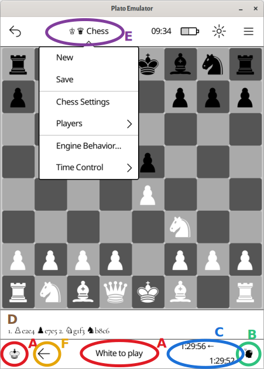

A chess board to play with friends or against the computer.

# Configuration

Configuration is mainly about engine (computer player software) path and its behavior (level, slowness, that is its willingness to use its time to prepare best move). The engine behavior may be dynamically set inside the application.

## Chess engine software

Chess is confirmed working with `stockfish 9.2` engine as compiled for `armhf` by debian team (provided that associated library `libstdc++.so.6` is also present).

It *should* work with any `uci` compatible engine. Chess engine path is to be pushed into:
```toml
[chess-engine-settings]
path = "bin/stockfish"
```

# Interface



Interface is standard chess board. On opening, the board is configured for human player on *white* and engine on *black*.

 - **A** Player to play (*white* or *black*)
 - **B** Player type (*human* or *engine*)
 - **C** Remaining time for players (note: this is not a hard limit, would mark *#:##:##* on timeout)
 - **D** Move transcript area
 - **E** Configuration menu
 - **F** Move back action

Menu items :

 - *new* to start a new game
 - *save* function is not implemented
 - *Players* set *human* / *engine* as *white* / *black* player (it is possible to have two humans or two engines playing)
 - *Engine Behavior* set engine level (as calibrated *ELO*) and slowness (willingness to consume its move time)
 - *Time Control* set clock as base (minutes) + increment (seconds)

Others features :

 - **force** engine move by pressing the engine icon (**B** when it is engine to play)
 - **rotate** the board by pressing the player color icon (**A**)
 - **move back** single move by clicking **←** (**F**) on bottom bar. May be done several time
 - **scroll** up, down, left (go to beginning), right (go to end) in the moves transcript area to see previous moves
 - long press on central zone of the interface to redraw the whole screen (combat pieces gosting)
 - board only allow *legal moves*
