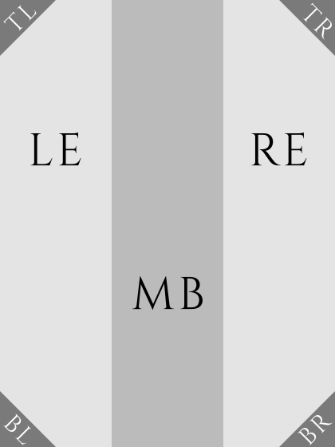
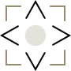

# Home

The following swipe sequences are recognized:

- Arrow west/east: go to the first/last page.
- Arrow north: set the current directory to the library's path.
- Arrow south: toggle the search bar.

## Address bar

When the navigation bar is present, this optional bar can be shown by swiping from the top bar to the shelf, and hidden by swiping from the shelf to the top bar.

## Navigation bar

This optional bar can be shown by swiping from the top bar to the shelf, and hidden by swiping from the shelf to the top bar.

This bar shows at most `max-levels` directory levels starting at the current directory. It can be used to navigate within the directory hierarchy.

- Tap to select/de-select a directory.
- Swipe north/south to resize.
- Swipe west/east to go to the next/previous page.

## Shelf

This is a view of the books within the current directory.

- Swipe west/east to go to the next/previous page.
- Tap on a book entry to open it.

The following swipe sequences are recognized:

- Arrow west/east: go to the first/last page.
- Top or bottom left/right corner: go to the previous/next status change.

## Search bar

The input's text is interpreted as a regular expression, and a book will match if any of its title, subtitle, author, series or file path matches.

One can target specific fields or states using selectors. A selector is a sequence of characters that starts with a single quote and is followed by a letter which represent a field or a state.

### Field selectors

The text that will be searched for is given after the selector.

- *t*: title.
- *u*: subtitle.
- *a*: author.
- *y*: year.
- *l*: language.
- *p*: publisher.
- *s*: series.
- *e*: edition.
- *v*: volume.
- *n*: number.

### State selectors

An exclamation mark can be prepended to a state selector's letter to invert its meaning.

- *R*: reading.
- *N*: new.
- *F*: finished.
- *A*: has annotations.
- *B*: has bookmarks.
- *O*: opened after the given date and time.
- *D*: added after the given date and time.

## Bottom bar

Tap and hold the next/previous page icon to go the last/first page.

Tap the library label to bring up the library menu.

# Reader

## Viewer

The screen is divided into nine regions:



Tap gestures by region:

- *WS* (West Strip):
	- Normal Mode: previous page.
	- Search Mode: previous results page.
- *ES* (East Strip):
	- Normal Mode: next page.
	- Search Mode: next results page.
- *CR* (Center Rectangle), *SS* (South Strip) and *NS* (North Strip): toggle the top and bottom bars.
- *NWC* (North-West Corner): previous location.
- *NEC* (North-East Corner): toggle bookmark.
- *SWC* (South-West Corner): toggle the table of contents in normal mode, previous page in search mode.
- *SEC* (South-East Corner): go to page in normal mode, next page in search mode.

Swipe west/east to go to the next/previous page.

Swipe north/south to scroll the page stream when the zoom mode is fit-to-width.

Rotate to change the screen orientation (one finger is the center, the other describes the desired rotation with a circular motion around the center: the two fingers should land and take off simultaneously).

Spread (resp. pinch) horizontally to switch the zoom mode to fit-to-width (resp. fit-to-page).
Spread (resp. pinch) diagonally to zoom in (resp. out) on the current page (the zoom mode is set to *custom*).

When the zoom mode is *custom*:
- Tapping a peripheral region moves the view port in the corresponding direction.
- Swiping moves the view port in the swipe's opposite direction.

The following swipe sequences are recognized:



- Arrow west/east: go to the previous/next chapter in normal mode, the first/last results in search mode.
- Arrow north/south: start searching text backward/forward.
- Top left/right corner: go to the previous/next bookmark.
- Top left/right multi-corner: go to the previous/next annotation or highlight.
- Bottom left corner: guess the frontlight if there's more than two frontlight presets defined, toggle the frontlight otherwise.
- Bottom right corner: toggle the dithering mode.

Simultaneous swipe sequences:

- Cross (east arrow with the left hand, west arrow with the right hand): go back to the home screen.
- Diamond (west arrow with the left hand, east arrow with the right hand): toggle the top and bottom bars.

### Text Selection

To select text, tap and hold the first or last word of the selection. Wait for the selection feedback. Move your finger on the other end of the selection and lift it. If you've made a mistake, select *Adjust Selection* and tap on the correct ends; tap and hold the selection when you're done.

## Bottom bar

Tap and hold the next/previous page icon to go the next/previous chapter.

## Top bar

Tap the title label to bring up the book menu.

# Home & Reader

Tap the bottom left and top right corners to do a full screen refresh.

Tap the top left and bottom right corners to take a screenshot.

## Menus

You can select a menu entry *without closing the menu* by tapping and holding it.

## Top bar

The frontlight can be toggled by holding the frontlight icon.

## Bottom bar

Tap the page indicator to go a specific page.

## Keyboard

The *ALT* and *SHIFT* keys can be locked by tapping them twice.

The *CMB* (combine) key can be used to enter special characters, e.g.: `CMB o e` produces `œ` (cf. [Combination Sequences](#combination-sequences)).

A tap and hold on the delete or motion keys will act on words instead of characters.

Tap and hold the space bar to bring up the keyboard layouts menu.

Keyboard layouts are described through a JSON object with the following keys:

- *name*: displayed in the keyboard layouts menu.
- *outputs*: list of output keys for each modifier combination (*none*, *shift*, *alt*, *shift+alt*).
- *keys*: description of each key on the keyboard. The following special key names (and abbreviations) are recognized: *Shift* (*Sft*), *Return* (*Ret*), *Alternate* (*Alt*), *Combine* (*Cmb*), *MoveFwd* (*MoveF*, *MF*), *MoveBwd* (*MoveB*, *MB*), *DelFwd* (*DelF*, *DF*), *DelBwd* (*DelB*, *DB*), *Space* (*Spc*). *▢* is used to indicate an output key.
- *widths*: width/height ratio for each key. The key gap's ratio is 0.06.

# Applications

Applications can be launched from the *Applications* submenu of the main menu.

You can go back to the previous view by tapping the top-left *back arrow*.

## Dictionary

*Dictionary* can be launched from the *Reader* view by tapping and holding a word or by making a text selection and tapping *Define* in the selection menu.

Dictionaries will be searched recursively in the `dictionaries` directory. The supported format is *dictd*: `.dict.dz` (or `.dict`) and `.index`. The dictionary definitions can be styled by creating a stylesheet at `css/dictionary-user.css`. The definitions that aren't formatted with XML are wrapped inside a *pre* tag. The font size and margin width can be changed in the `[dictionary]` section of `Settings.toml`.

You can select the search target by tapping the label in the bottom bar. You can set the input languages of a dictionary by tapping and holding the target's label. You can then provide a comma-separated list of IETF language tags (e.g.: *en, en-US, en-GB*).

You can toggle the fuzzy search mode by tapping the related entry in the search menu (brought up by tapping the search icon). If it's enabled, the headwords that differ only slightly ([Levenshtein distance](https://en.wikipedia.org/wiki/Levenshtein_distance) ≤ 1) from the current query will be considered matches.

## Calculator

*Calculator* is a thin wrapper around [ivy](https://github.com/robpike/ivy), an APL-like calculator. A keyboard on the bottom accepts input. Pressing return sends the input to `ivy` and the response is displayed on the screen.

To learn more about how to use `ivy`, type `)help`. For an introduction, type `)help intro`. To run the interactive demo, type `)demo`. An important point to keep in mind is that all binary operations are right-associative (like in APL or J), so `3*5+7` is parsed as `3*(5+7)` not `(3*5)+7`.

You can back and forth in history by tapping on the buttons to the left and right of the input field respectively. `ivy`'s output can also be scrolled up or down.

You can adjust the margin and font size by tapping on the buttons in the bottom bar.

Here is an example of `ivy` code showing its conciseness. The code below appears in one of the Plato screenshots. It defines a binary operator `lab` that takes two inputs `a` and `b` and displays an `a` by `b` grid of Unicode characters.

```j
op a lab b = char 9584 + ? a b rho 2
```

You can add custom operators in a file called `lib.ivy` (alongside the `ivy` binary), if it exists, it will be loaded when the application starts.

# Input Fields

Tapping an input field will:
- Focus the input field if it isn't.
- Move the cursor under your finger if it is.

Tap and hold inside an input field to bring up the input history menu.

# Annex

## Combination Sequences

	o e   œ       a `   à       u "   ű       ] ]   
	O e   Œ       e `   è       o "   ő       + -   ±
	a e   æ       i `   ì       U "   Ű       - :   ÷
	A E   Æ       o `   ò       O "   Ő       < =   ≤
	c ,   ç       u `   ù       z .   ż       > =   ≥
	C ,   Ç       A `   À       Z .   Ż       = /   ≠
	a ;   ą       E `   È       t h   þ       - ,   ¬
	e ;   ę       I `   Ì       T h   Þ       ~ ~   ≈
	A ;   Ą       O `   Ò       a o   å       < <   «
	E ;   Ę       U `   Ù       A o   Å       > >   »
	a ~   ã       a ^   â       l /   ł       1 2   ½
	o ~   õ       e ^   ê       d /   đ       1 3   ⅓
	n ~   ñ       i ^   î       o /   ø       2 3   ⅔
	A ~   Ã       o ^   ô       L /   Ł       1 4   ¼
	O ~   Õ       u ^   û       D /   Đ       3 4   ¾
	N ~   Ñ       w ^   ŵ       O /   Ø       1 5   ⅕
	a '   á       y ^   ŷ       m u   µ       2 5   ⅖
	e '   é       A ^   Â       l -   £       3 5   ⅗
	i '   í       E ^   Ê       p p   ¶       4 5   ⅘
	o '   ó       I ^   Î       s o   §       1 6   ⅙
	u '   ú       O ^   Ô       | -   †       5 6   ⅚
	y '   ý       U ^   Û       | =   ‡       1 8   ⅛
	z '   ź       W ^   Ŵ       s s   ß       3 8   ⅜
	s '   ś       Y ^   Ŷ       S s   ẞ       5 8   ⅝
	c '   ć       a :   ä       o _   º       7 8   ⅞
	n '   ń       e :   ë       a _   ª       # f   ♭
	A '   Á       i :   ï       o o   °       # n   ♮
	E '   É       o :   ö       ! !   ¡       # s   ♯
	I '   Í       u :   ü       ? ?   ¿       % o   ‰
	O '   Ó       y :   ÿ       . -   ·       e =   €
	U '   Ú       A :   Ä       . =   •       o r   ®
	Y '   Ý       E :   Ë       . >   ›       o c   ©
	Z '   Ź       I :   Ï       . <   ‹       o p   ℗
	S '   Ś       O :   Ö       ' 1   ′       t m   ™
	C '   Ć       U :   Ü       ' 2   ″       
	N '   Ń       Y :   Ÿ       [ [          
